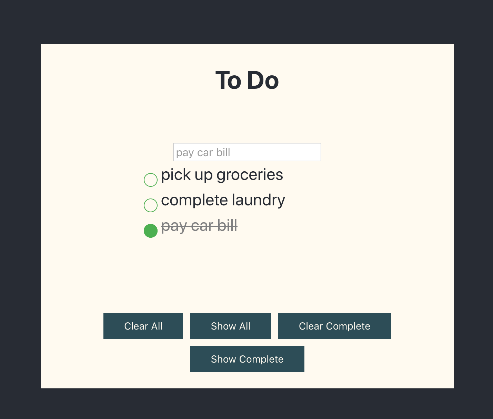

This project was bootstrapped with [Create React App](https://github.com/facebook/create-react-app) and was built as I learned the basics of react.

# Live Preview

Check out the project live at [React To Do App](https://p-misner.github.io/ReactToDo/).



# Running Locally

If you really want to run this project locally, follow these steps.

1. Clone the repository

```
git clone https://github.com/p-misner/ReactToDo
```

2. Install missing modules from package.json

```
npm install
```

3. Run locally
   Launch the page on the browser of your choice

```
npm start
```
